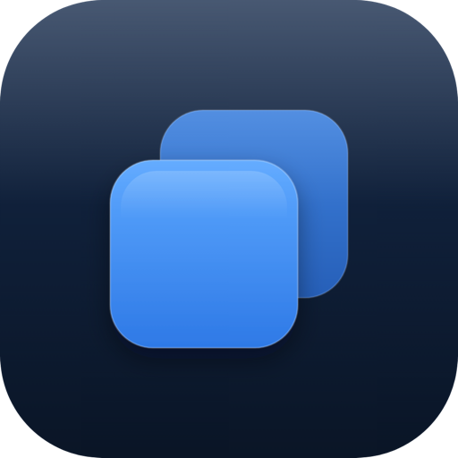
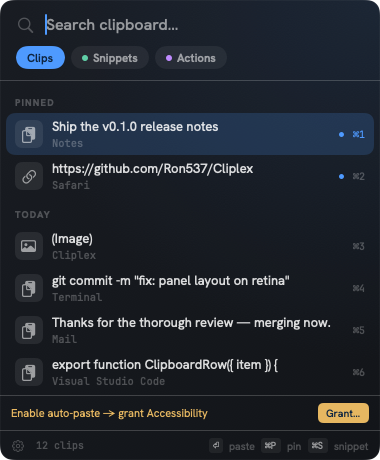
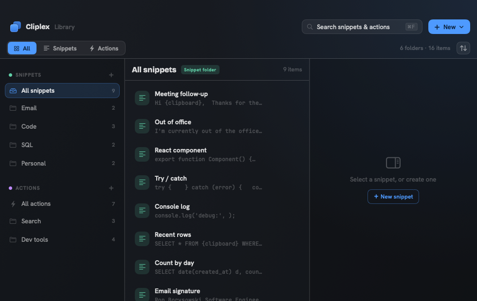
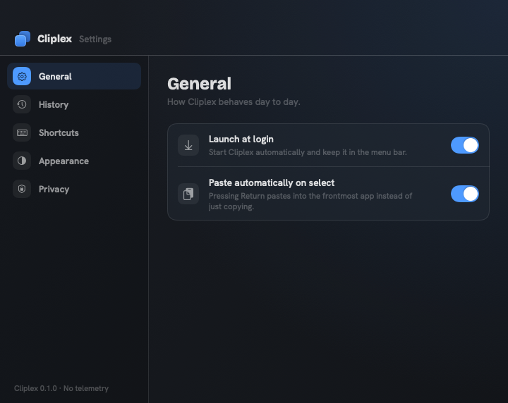

<div align="center">



# Cliplex

**A fast, private, native clipboard manager for macOS — history, snippets, and quick actions, with instant search.**

[](https://github.com/Ron537/Cliplex/actions/workflows/ci.yml)
[](LICENSE)
[](#install)
[](#stack)
[](PRIVACY.md)



</div>

A lightweight menu-bar app that remembers what you copy, stores reusable
snippets, runs quick clipboard **actions**, and finds any of it instantly with
full-text search — all from a panel that opens **right at your cursor**. No
telemetry, no account, no cloud. Nothing leaves your machine.

## Why Cliplex?

Most free clipboard managers make you choose: **Maccy** has great search but no
snippets; **Clipy** has snippet folders but no search. Cliplex brings clipboard
history, snippet folders, quick actions, **and** instant search together in one
fast, native, MIT-licensed app — with per-item global shortcuts and zero
telemetry.

| | **Cliplex** | Maccy | Clipy | CopyQ | Paste | Raycast |
|---|:---:|:---:|:---:|:---:|:---:|:---:|
| Clipboard history | ✅ | ✅ | ✅ | ✅ | ✅ | ✅ |
| Snippet folders | ✅ | ❌ | ✅ | ⚠️ | ⚠️ | ✅ |
| Quick actions (open URL/app, transforms) | ✅ | ❌ | ❌ | ✅¹ | ❌ | ✅ |
| Instant full-text search | ✅ | ✅ | ❌ | ✅ | ✅ | ✅ |
| Per-item / folder global shortcuts | ✅ | ⚠️ | ⚠️ | ⚠️ | ⚠️ | ✅ |
| Cursor-anchored panel | ✅ | ❌ | ❌ | ❌ | ✅ | ❌ |
| Local-only, no telemetry | ✅ | ✅ | ✅ | ✅ | ❌² | ❌² |
| Free & open source | ✅ MIT | ✅ MIT | ✅ MIT | ✅ GPL | ❌ | ❌ |
| Native (Swift / SwiftUI) | ✅ | ✅ | ✅ | ❌ Qt | ✅ | ✅ |

<sub>✅ built-in · ⚠️ partial / different model · ❌ not available. ¹ via scripting. ² cloud sync / commercial. Comparison reflects publicly documented features and evolves over time.</sub>

## Highlights

- **Clipboard history** — text, rich text, images, files, and color swatches,
  with most-recently-used ordering and pinning.
- **Snippets** — reusable text organized into folders, shown as a collapsible
  tree. Use `{clipboard}` to weave in whatever you copied last.
- **Quick actions** — open a URL/app/path or transform the clipboard
  (Base64, JSON pretty/minify, URL-encode, case, hash, trim…) in one keystroke.
- **Instant search** — SQLite FTS5 as-you-type over history, snippets, and
  actions.
- **Cursor-anchored panel** — a non-activating panel that opens where your mouse
  is and never steals focus, so paste lands in the app you were using.
- **Per-item shortcuts** — assign a global hotkey to any snippet, action, or
  folder.
- **Quick paste** — ⌘1–⌘0 for the top items; ⏎ to paste the selection.
- **Privacy by default** — concealed/password clips and configured apps are
  never stored; the database is entirely local.

## Screenshots

| Library — manage snippets & actions | Settings |
|---|---|
|  |  |

<sub>Screenshots use generic demo data and are regenerated with
[`tools/screenshots/`](tools/screenshots/).</sub>

## Install

> [!NOTE]
> Release builds are **ad-hoc signed but not notarized** (Cliplex is free and
> doesn't carry a paid Apple Developer certificate). The app is safe and runs
> fine — macOS just shows a one-time Gatekeeper prompt for a *downloaded* build.
> See [first launch](#first-launch) below. Building from source has no prompt.

**Download:** grab the latest `Cliplex.dmg` from the
[Releases](https://github.com/Ron537/Cliplex/releases) page, open it, and drag
**Cliplex** to **Applications**.

**Homebrew (planned):**

```bash
brew install --cask cliplex
```

**Build from source** (no Gatekeeper prompt):

```bash
git clone https://github.com/Ron537/Cliplex.git
cd Cliplex
./scripts/build-app.sh      # build + bundle + sign
open build/Cliplex.app
```

### First launch

Because downloaded builds aren't notarized, the first time you open Cliplex
macOS says *"Apple could not verify Cliplex is free of malware."* To allow it:

1. Open **System Settings → Privacy & Security**, scroll to **Security**, and
   click **Open Anyway** next to the Cliplex message, then confirm.

Or, from Terminal, remove the download quarantine flag:

```bash
xattr -dr com.apple.quarantine /Applications/Cliplex.app
```

You only need to do this once.

**Build from source:**

```bash
git clone https://github.com/Ron537/Cliplex.git
cd Cliplex
./scripts/build-app.sh      # build + bundle + sign
open build/Cliplex.app
```

Open the panel with **⌘⇧V**. Auto-paste needs **Accessibility** permission
(System Settings → Privacy & Security → Accessibility); the dev build signs with
a stable self-signed certificate so the grant persists across rebuilds.

### Verify the build

Release builds aren't notarized, so if you want extra confidence the DMG is
genuine, verify its checksum and build provenance:

```bash
# Compare against the SHA-256 published on the release page (SHA256SUMS.txt):
shasum -a 256 ~/Downloads/Cliplex-0.1.0.dmg

# Verify the Sigstore build attestation (proves it was built by the release
# workflow from this repo, on GitHub-hosted runners):
gh attestation verify ~/Downloads/Cliplex-0.1.0.dmg --repo Ron537/Cliplex
```

## FAQ / Troubleshooting

**"Apple could not verify Cliplex is free of malware."**
Expected for a free, un-notarized build. Approve it once via System Settings →
Privacy & Security → **Open Anyway**, or run
`xattr -dr com.apple.quarantine /Applications/Cliplex.app`. See
[First launch](#first-launch).

**The panel (⌘⇧V) opens but pasting doesn't work.**
Auto-paste needs **Accessibility** permission. Grant it in System Settings →
Privacy & Security → Accessibility, then toggle Cliplex off/on if it was already
listed.

**Nothing is being captured from some apps.**
By design — clips marked concealed/transient (password managers, etc.) and apps
in your exclusion list are never stored. See [PRIVACY.md](PRIVACY.md).

**Where is my data? How do I reset it?**
Everything lives in `~/Library/Application Support/com.rborysowski.cliplex/`.
Quit Cliplex and delete that folder to start fresh.

**Does Cliplex phone home / sync / collect analytics?**
No. Zero network access, no telemetry, no account. Everything is local.


- **Swift** (Swift Package Manager), macOS 14+
- **AppKit** menu-bar agent + **SwiftUI** content
- **[GRDB.swift](https://github.com/groue/GRDB.swift)** — SQLite + FTS5
- No App Sandbox (a clipboard manager must read the global pasteboard and
  synthesize ⌘V via Accessibility)

## Project layout

| Path | Purpose |
|------|---------|
| `Sources/CliplexKit/` | Testable, UI-independent core: storage (`Database`), models, FTS `Search`, `MacClipboard`, `ClipboardMonitor`, `Capture` (privacy filter), `Settings`, `Accessibility`, `Paste` (CGEvent ⌘V), `PanelLayout` |
| `Sources/Cliplex/` | The menu-bar app: status item, hotkeys, `PanelController`, the SwiftUI panel + Library/Settings windows, `Theme`, `LoginItem` |
| `Tests/CliplexKitTests/` | Swift Testing suite |
| `Resources/` | `Info.plist`, entitlements, bundled fonts |
| `scripts/` | Build/bundle/sign and test helpers |
| `tools/screenshots/` | Reusable screenshot pipeline (generic demo data) |
| `assets/branding/` | Vector logo masters; regenerate icons with `scripts/gen-icons.sh` |
| `site/` | GitHub Pages landing page + changelog template. Preview locally with `node scripts/serve-site.mjs` (builds `_site/`, serves on :8080, live-rebuilds) |

## Build & run

```bash
# Build, bundle, and sign Cliplex.app (creates a self-signed dev cert on first run)
./scripts/build-app.sh
open build/Cliplex.app

# Run the tests
./scripts/test.sh
```

### Toolchain notes (Command Line Tools, no full Xcode)

The scripts inject what the Command Line Tools toolchain needs; if you invoke
`swift` directly you may need them too:

- A `safe.bareRepository=all` git override (the machine's global config may set
  it to `explicit`, which blocks SwiftPM's bare dependency repos).
- Framework/library search paths for the Swift Testing runtime — see
  `scripts/test.sh`.

With full Xcode installed, `swift build` / `swift test` work without extra flags.

## Privacy

See [PRIVACY.md](PRIVACY.md). In short: everything is stored locally in
`~/Library/Application Support/com.rborysowski.cliplex/cliplex.db`, there is no
network access, and password-manager / concealed clips are ignored.

## Contributing

Issues and PRs are welcome — see [CONTRIBUTING.md](CONTRIBUTING.md) and the
[Code of Conduct](CODE_OF_CONDUCT.md). For security reports, see
[SECURITY.md](SECURITY.md).

## License

[MIT](LICENSE). Bundled fonts are licensed under the SIL Open Font License — see
[`Resources/Fonts/README.md`](Resources/Fonts/README.md).
